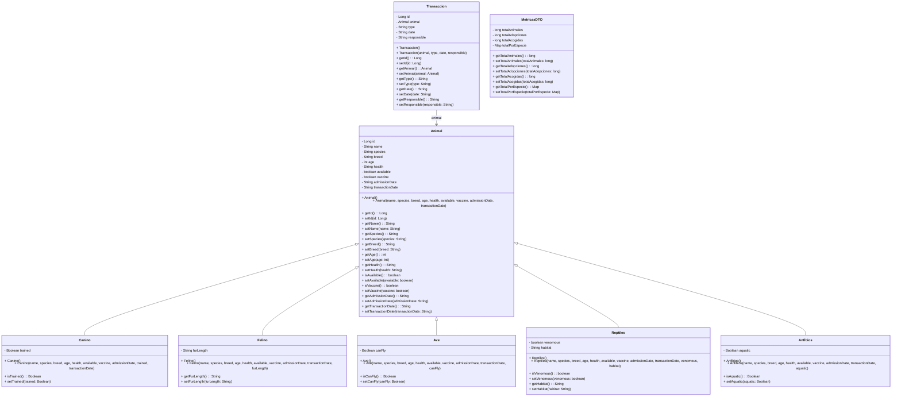

# VetShelter 🐾
This is a full-stack web application designed to support the management of animal shelters and adoption centers. It allows administrators and staff to register animals, track their health and vaccination status, record adoptions and temporary fosters, and also monitor key statistics related to shelter activity.

This is a demonstration project — there is no user authentication or access control. It showcases basic CRUD operations, data filtering, and Excel export functionality for managing animals in a veterinary shelter.

## 💡 Features
* Register animals of different types (dogs, cats, birds, etc.)

* Register adoptions and temporary sheltering (fostering)

* Filter animals by health status, vaccination, availability, and species

* Download transactions (adoptions/fosters) in Excel format

### View statistics:

* Total number of animals

* Number of adoptions and fostering events

* Number of animals per species

## 🧱 Tech Stack
### Backend
* Java 21

* Spring Boot

* RESTful APIs

* JPA/Hibernate

* Embedded H2 database (or another of your choice)

* Lombok

* Apache POI (for Excel export)

* Springdoc OpenAPI (for Swagger UI)

### Frontend
* React 18

* Material UI

## 🚀 Running Locally
### * Backend
      cd veterinaria-api
      ./mvnw spring-boot:run
### * Access Swagger UI:
      http://localhost:8080/swagger-ui.html

### Frontend:
    cd veterinaria-frontend
    npm install
    npm start
* The app should be available at http://localhost:3000

## 📂 Project Structure
### Backend:
    src/main/java/com/vetshelter/
    │
    ├── controller/
    │   └── AnimalController, TransaccionController, StatisticsController...
    ├── model/
    │   └── Animal, Canino, Felino, Ave, Transaccion...
    ├── repository/
    │   └── AnimalRepository, CaninoRepository, etc.
    ├── service/
    │   └── AnimalService, TransaccionService, StatisticsService

### Class Diagram

### Frontend:
    src/
    ├── components/
    │   └── TransactionForm.js, StatisticsPage.js, AnimalList.js...
    ├── services/
    │   └── vetApi.js
    ├── App.js
    ├── index.js

## 📦 Excel Export
You can export all transactions via a button in the transaction form page. The generated Excel file will include all adoption/foster events registered so far.

## ⚠️ Notes
This project is for demonstration purposes only.

No user authentication or role-based access has been implemented.

It runs only locally, and assumes both backend and frontend are running on localhost.
